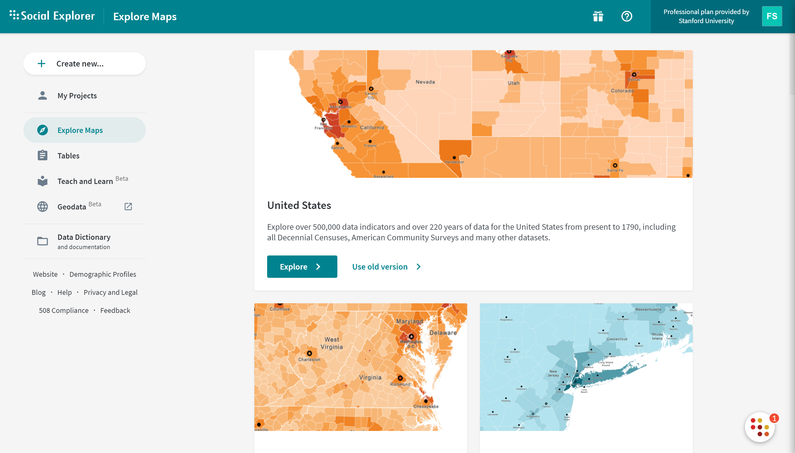

# Using Social Explorer {#socialexplorer}

In this chapter we will cover how to use the Social Explorer data tool to access demographic and social data for your neighborhood and the city that encompasses it. The tool is quite intuitive to use and allows you to quickly acquire current and historical census and demographic data. Although Social Explorer allows users to create maps, we will not use the mapping functionality. We will use a different mapping software - ArcGIS Online (AGO) - that is easier to incorporate into the final ArcGIS Story Map that you will create. AGO and Story Maps software will be introduced in the subsequent tutorials. 

Social Explorer will be particularly helpful for you as you complete Neighborhood Assignment #1 (especially question #5). This tool may also be useful to you when you complete Neighborhood Assignment #5 in week 5. 

A basic outline of the steps you will need to take to complete the assignment are as follows: 

1. Log-in to Social Explorer via Stanford Libraries & Stanford credentials 
2. Navigate to data tables
3. Select a dataset
4. Select a geography
5. Select variables
6. Export data

This tutorial will walk through each of the steps using an example city and census tracts.

## Accessing Social Explorer

Stanford provides students and staff with access to Social Explorer via an institutional license. All that is required to use Social Explorer is your Stanford key and password. Go to the [Stanford Libraries homepage](https://library.stanford.edu/) and type Social Explorer into the search bar. [Try this](https://library.stanford.edu/all/?q=social+explorer&op=Search). The first hit under the Catalog panel is the Social Explorer data tool. Click on the external Social Explorer link at the bottom of the top entry, which is outlined in red in the image below. 

You will then be prompted to provide your Stanford credentials. After logging in you should see the Social Explorer home page. Navigate over to the Tables tab in the left-hand sidebar. This is outlined in red in the image below. 

## Navigate to Data Tables

## Select your dataset

## Select your geography 

## Select your variables

## Export data

Census data, despite its various limitations, is some of the best data researchers and practitioners typically have to understand who’s in our urban areas, and how they’re doing in their year-to-year lives. Understanding how to work with this data is critical and deserves a whole chapter in this curriculum.