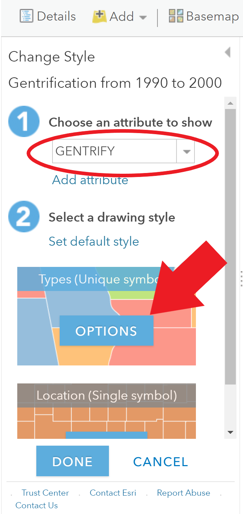

# Mapping Gentrification

In Assignment #7, we have the opportunity to map gentrification occurring in and around your neighborhood over the last 30 years. Like with the segregation measures, gentrification is a phenomenon that we measure over space and time. The assignment instructions on Canvas noted that there are multiple ways to define and measure gentrification. For the purposes of this assignment, we will conceptualize gentrification as a neighborhood-level socioeconomic transformation comprised of both an influx of middle-and upper-class residents and an increase in housing prices in previously low-income, urban neighborhoods.


## Measuring Gentrification

Our measure of gentrification is calculated at the census tract level for three consecutive decades: 1990 to 2000, 2000 to 2010, and 2010 to 2020, so that we can examine how the socioeconomic composition of neighborhoods in our cities changes over each decade. The four variables listed below are used in our categorical measure of gentrification: 

* Median household income (in 2020 Dollars)
* Percent of college-educated residents 
* Median home value (in 2020 Dollars)
* Median gross rent (in 2020 Dollars)  
  

The first step in computing the gentrification measure is determining whether or not a tract is **eligible to gentrify (i.e., Gentrifiable).** Generally, researchers consider tracts eligible to gentrify if they are relatively low-income neighborhoods such that they could undergo the revitalization that characterizes gentrification. We will operationalize eligibility to gentrify in a binary fashion using the median household income.

>  **Not Gentrifiable**: Census tracts had a median household income *above* the city-wide median household income at the start of the decade period. 

> **Gentrifiable**: Census tracts had a median household income *below* the city-wide median household income at the start of the decade period. 

**Among the census tracts that were Gentrifiable, we must determine if they were gentrifying over the decade period or not.** To classify the gentrifiable tracts as gentrifying or not gentrifying, we will need to calculate how much socioeconomic change and housing value change the tract experienced over the decade and compare the rate of change to the rate in the city. 

> **Gentrifying**: Gentrifiable census tracts that had the socioeconomic status of their residents (i.e., % college graduates OR median household income) grow faster than the city wide-median *AND* the home values (median home value OR median gross rent value) grow faster than the city-wide median over the decade period. 

> **Not Gentrifying**: Gentrifiable census tracts that did NOT experience growth in the socioeconomic status of their residents *AND* their home values at a rate higher than the city-wide median values over the decade period.

This measurement strategy results in a three-category gentrification measure - Not Gentrifiable, Gentrifying, and Not Gentrifying. With these three categories we can make a thematic map of census tracts in and around our neighborhood. The tracts in your neighborhood's city have been classified according to this measurement strategy, now we just need to load the layers into the AGO and style them with the appropriate symbology. 


## Gentrification Map

Open up a new map and style the base map as you would like. The minimalist basemaps will probably serve you best for this assignment because we are going to create a series of categorical thematic maps. Then, navigate to the **Add Layers** tab on the toolbar and select **Search for Layers.** Within **My Groups,** search for the census tracts layers with the gentrification measures from 1990 to 2000. There is a separate layer for each decade period. The layer naming structure for each decade is as follows: **"City_Name_tracts_gent_1990_2000".**   

Once you have added the layer, go into the **Change Style** option on the layer. First, choose **GENTRIFY** as the attribute that you want to show. Then, select **Options** on the **Types (Unique Symbols)** drawing style.   

```{r change style image, out.height = '33.3%',fig.align = 'center',  echo = FALSE}


```
  


You can now set up a color scheme for the three categories. It is up to you to choose whether you would like to use a predefined color palette generated by ESRI or manually set the colors for each category. The image below indicates which icons to click on for these two options.    

    
  

To reorder the categories listed on the legend, just click on the **three vertical dots** next to any one of the categories and drag it up or down to adjust its placement in the legend. When you are happy with the color scheme, click **Ok** and return to the contents pane and map viewer. Go ahead and also **add your neighborhood boundaries** and **style the layer the same way we have before with the transparent fill and an outline.** Make note of the gentrification status of your neighborhood and the areas around your neighborhood.    


Repeat this process again for the other two decades. In the layers search panel, you just need to change the years in the suffix to find the measures for the next two decades. When you are bringing in the layers for the two other decades, be sure to style them in the same way that you styled the 1990 to 2000 layer. The consistency makes it easier to see what is changing or not between the decades. When you are done, you should have four layers in your contents pane - the neighborhood boundaries (on top), the 2010 to 2020 gentrification layer, the 2000 to 2010 gentrification layer, and the 1990 to 2000 gentrification layer.   


When you are happy with the look of your map, navigate to the **Save** tab on the toolbar and use the **Save As** option to save your map. Give it an informative title, description, and tags. Be sure to share it with our class's group using the **Share** tab in the toolbar. You can also grab the weblink to include in your write-up. 


After you have done your neighborhood observations, either in person or via Google Street View, you will return to this map to add an additional layer of geocoded locations that were or are involved in neighborhood change. For a refresher on geocoding, view the [tutorial on geocoding][Preparing Data for Geocoding]. If you would like to configure the pop-ups that appear on your geocoded locations to have images or a description of the site, view the optional [Configuring Pop-ups section below][Configuring Pop-Ups (Optional)] *before* you load your CSV file with the addresses into AGO. The [Configuring Pop-ups section below][Configuring Pop-Ups (Optional)] also contains an example of configuring pop-ups on the gentrification layers, too, in case you want to embed graphs/charts and descriptions of the numeric data on the map-layer. Otherwise, you can upload the spreadsheet with addresses as usual and skip over to the section on viewing [historical Google Street View images][Historical Google Street View].  


## Configuring Pop-ups (Optional)

In addition to using different types of symbology on your map layers to convey information about an area of interest, you can also use pop-ups to display descriptive information about features on your map. Pop-ups can show attachments, images, and charts, and can link to external web pages.

Up to this point, when you have clicked on features in your map layer, the pop-ups have been a plain list of attributes and values. This is the default appearance for pop-ups, but AGO does allow you to reconfigure the pop-ups to define the list of visible and hidden fields, and how the information is presented. The main decisions map authors make about pop-ups are what information they want to show and what is the best way to present that information. For example, if you want to show people what is located at the place you just geocoded, you might configure pop-ups to show the address, a description of the place and the role it has played in neighborhood change, and an image. For the layers with the gentrification measures, you could configure pop-ups to show the median household income, the percent of residents with college degrees, the percent of owned housing units, and/or the median home and rent values for each decade, or the percent change in these variables over time. Depending on what you are trying to show in pop-ups for your feature layer, you can choose from a variety of configuration options. 

The following provides a brief description of some of the main pop-up configuration options:

* **List of field attributes**: A list of field attributes shows the variable names and values for the selected feature. Authors can modify the visibility, order, number formatting, and date formatting so the information appears in a logical and understandable format.
* **Description from one field**: When a pop-up contains a description from one field, all the contents of one field are displayed in the description. It is a useful option when the layer has attributes that contain a custom description.
* **Custom attribute display**: This option allows authors to define, format, and lay out the information to display. Authors can embed attributes and control them via a rich text experience. This is a good option when you want to manually enter the attribute information and format it with rich-text editing tools for controlling font color, size, style, and so on. 
* **No attribute information**: A pop-up does not need to contain attribute information. Sometimes a title or an image is all that's needed to convey information such as points of interest.

You do not need to configure pop-ups on the map you turn in for Assignment #7, however, you may find it a useful way to pick out information about tracts in and around your neighborhood to reference in your write-up, e.g., the percent change in the median household income or residents with a college degree. This section is also included because some of you may find that configuring pop-ups will work well for the Story Map template or style that you choose in a few weeks. You are encouraged to come back to this section when you are refining your existing maps to prepare them for the Story Map. 


The subsections below will walk you through some of the configuration options that would be most relevant for this assignment. **If you want to configure pop-ups for the address locations that you are geocoding, read through subsections 1 through 3 *before* geocoding and configuring the pop-ups**. This ensures that you can set-up your CSV file in the manner that is most compatible to the pop-up configuration option you choose to use.   


### List of Attributes

When you have geocoded the locations rendered in AGO as a layer point features, the pop-ups display all the attributes you entered in the spreadsheet - Name, Street Address, City, State, and Zipcode - in list format. To change this configuration and display only certain attributes, click on the **More Options** tab (the three horizontal dots icon) on the layer in the content pane. In the drop-down menu, find and click on **Configure Pop-up**.

Then, navigate to the **Configure Attributes** link below the list of attributes under Pop-up Contents. This is circled in red next to the number 1 in the image below. The image below shows the configure attributes options that will appear for you. You have multiple options in this window. 

* Select the attributes that you want to display by checking the fields in the first column. 
* If you need to edit the display format of the field, check the field in the second column and change the text-box type. 
* Leave the Field Names in the third column as they are. These do not show up on your pop-up.
* If you want to change the Field Alias, which is the label displayed on the pop-up, click on the current field alias and type in a new label. 


  

The GIF below shows how you could configure a pop-up to only show the street address for the geocoded locations. 

 

  

We can add a some more detailed and richer information to our pop-ups though. The next subsection will cover how to add a picture and caption.  


### Show Images

In your neighborhood observations, you either took pictures of the locations that were or are involved in neighborhood change or screen-grabbed the locations from Google images/Google Street View. You could include those images in the pop-ups, so that when someone clicks on one of the locations that you have geocoded, the pop-up shows them a picture of what is located in that place. 

In order to have these images render in the pop-up, you will need to add them to the spreadsheet where you are recording your addresses. Create a new column to hold the URLs for the images in the spreadsheet. Copy the URLs into the cells for each respective location. An example is shown in the image below. If you are using images that you personally took, you need to host them on the Web. The easiest way to do this is to store them in your Google Drive and setting the share option for the link to public. 

 

When you have geocoded the locations rendered in AGO as a layer point features, navigate to **Configure Pop-ups** in the **More Options** tab on your layer. Scroll down to the bottom of the configuration options pane to **Pop-up Media.**

1. Click the **Add** button and the **Image** option from the drop-down menu.
2. Give the image a title or leave the field blank. You can decide what you would work best for your pop-ups. 
3. You can add an image caption or leave it blank. You can use the **Plus-sign** to the right of the field to add a field name in the caption. By using a field name in the caption, AGO will populate the text from the field name into the caption, so that it is customized appropriately for each feature in your layer. See the example in the GIF below.
4. In the URL field, add the field name in your CSV file that corresponds with where you stored the links to the images. 
5. Leave the link field blank, unless you want to send the viewer to the webpage with the image. Click Ok and return to the map viewer to see how your pop-up renders the image.    

The GIF below is an example of how to configure the pop-up to show an image. 

    


You may find this pop-up configuration useful for other maps with geocoded point layers that you created before like the locations of eyes on the street/broken windows/collective efficacy (Assignment #3) or the key non-profit organizations (Assignment #4). If you choose to use either of these maps in your Story Map, you can return to the CSV file that you recorded the addresses in and add a new column with the URLs for your images. 


### Descriptions

Configuring a few sentences or a paragraph of text as a description of the place in the pop-up is very similar to configuring an image. If you want to include a description of the place on the pop-up, the easiest way to do this for all features in your address CSV file is to create a new column in your CSV and type a the description in the cell. An example of how to format the spreadsheet is shown in the image below. 

 

Geocode the layer in AGO as you have done before. Then, navigate to **Configure Pop-up** in the **More Options** tab. This time you just want to show the description and not the list of attributes, so select the display option: **A description from one field**. Set the Attribute as the field name you gave to the description in your spreadsheet. Then, click **Ok** and view the pop-ups on your map. The GIF below shows an example of how to configure the descriptions. 

  

Again, you may find this pop-up configuration useful for the layers you geocoded in Assignments #3 and #4. You can return to those later in the quarter. At this point, go ahead a edit your CSV file with the locations of neighborhood change based on the pop-up information you want to include. Then, proceed to geocode and configure your pop-ups appropriately.   


### Charts & Graphs

Map layers with numeric attribute information like household income and percentages of owned housing units can be displayed visually in pie charts, bar charts, column charts, and line charts within your pop-up. The steps below demonstrate how to do this with one of your gentrification layers. 

**UPDATE**


### Customized Rich-Text 

It is possible to display any type of attribute - numeric, text, or date-time - on a map layer with some customized rich-text. To do this, we need to use the attribute expressions tool. 

**UPDATE WITH EXAMPLE**  


## Historical Google Street View

Have the addresses of the locations that you recorded from your neighborhood observations handy because we are going to locate them in Google Maps and view images of the location taken at multiple points in time in Google Street View. Once you have typed an address into the Google Maps Search Bar and the location has been pinpointed on the map, **click and drag peg-man, the yellow stick figure in the bottom-right corner of your map (just below the zoom in and out buttons)**, over to the street nearest the pinpointed location on the map. The street view image of the area near the address you typed in will appear on your screen. If you pan around a little bit, you should see the building/physical items you observed and recorded the address for.  


The image that you are viewing is Google Street View's most recent image of the area. Navigate over to the top-left corner of your screen and **click on the clock icon with curved arrows** below the address to activate a small window with a series of all images recorded for this location. At the bottom of this window is a timeline that you can interact with. **Move the white circle along the timeline** to see the images and the year in which they were recorded. To view these older images on the full screen, click on any one of the previous images in the small window. You will see that image appear on the main viewing screen. From here, you can pan around and view what the surrounding area looked like at this period. An example is featured in the GIF below. 

  

